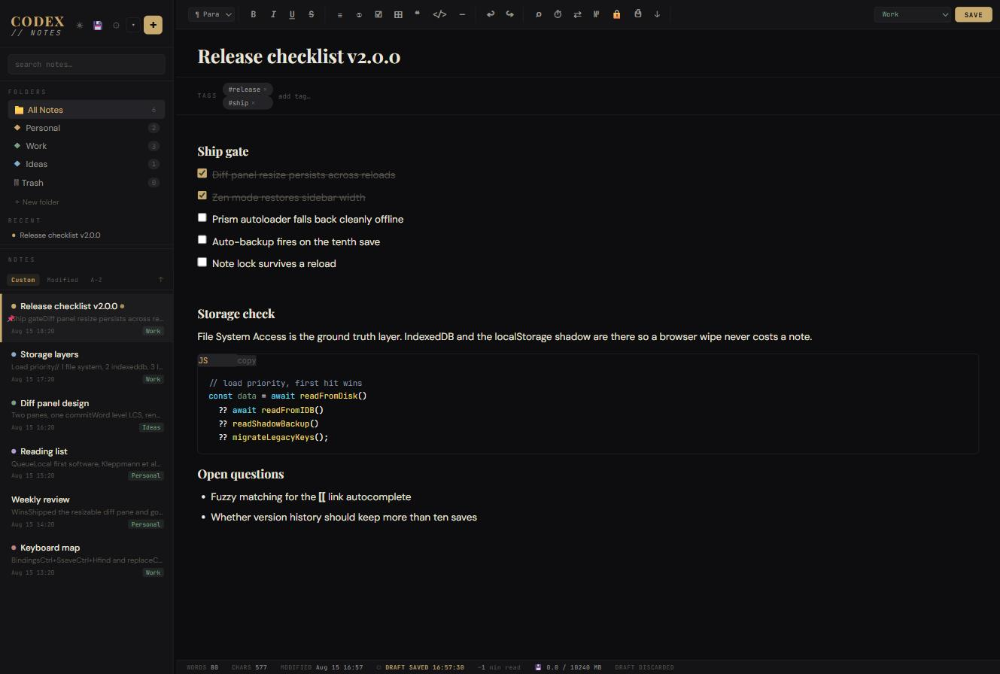

# CODEX // NOTES

> A single-file, local-first note-taking application. No installation. No account. No server. Just open the file and start writing.



---

## What it is

CODEX is a fully self-contained HTML file - every feature, every line of CSS, every function lives inside `Codex-Notes.html`. Drop it anywhere, open it in Chrome or Edge, and you have a full-featured note-taking environment that stores everything in your browser and optionally writes a live JSON file directly to your disk.

It was built for people who want the features of a real notes app without the overhead of installing one.

---

## Getting started

1. Download `Codex-Notes.html` from the `src/` folder
2. Open it in Chrome or Edge (File System Access API required for disk writes)
3. That's it - no setup, no dependencies to install, no account to create

> **Recommended:** Right-click → Open with → Google Chrome. Pin it to your taskbar or bookmark it for daily use.

---

## Storage

CODEX uses a three-layer storage system so your notes are never at risk from a single point of failure:

| Layer | Where | When |
|---|---|---|
| **IndexedDB** | Browser storage (primary) | Every save |
| **localStorage backup** | Browser storage (shadow) | Every save |
| **File System** | Real file on your disk | Every save (if enabled) |

### Enabling file system storage (recommended)

Click **⚙** → **PICK FOLDER & ENABLE** → choose any folder on your machine (e.g. `Documents\CodexNotes`). CODEX will write `codex-data.json` to that folder on every save. This file is your ground truth - it survives browser wipes, profile resets, and switching between browsers.

> **Note:** Chrome blocks system/root folders (e.g. `C:\`, `C:\Windows`). Pick a user folder like `Documents\Notes` or `Desktop\Codex`.

### Running from a web server

If you host the file on a local web server (e.g. `http://192.168.1.10/Codex-Notes.html`), storage works the same way - everything is saved in the *accessing browser's* local storage, not on the server. The File System Access API still works and lets you write to your local disk even when accessing via HTTP.

---

## Features

### Editor
- **Rich text editing** - Bold, italic, underline, strikethrough, headings (H1–H4), blockquotes, lists
- **Find & Replace** - `Ctrl+H`
- **Line numbers** - Toggle via toolbar
- **Image paste** - Paste images directly from clipboard; auto-compressed to JPEG
- **Markdown paste detection** - Pasting markdown converts it to formatted text automatically
- **Syntax highlighting** - Code blocks get a language selector and copy button; 22 languages via Prism.js
- **Checklist items** - Tickable checkboxes that persist with the note
- **Table insertion** - Grid picker in toolbar for N×M tables
- **Note linking** - Type `[[` to search and link to another note by title

### Organization
- **Folders** - Create folders with `Parent/Child` syntax for one level of nesting
- **Tags** - Add tags to any note, search by tag
- **Pinned notes** - Pin important notes to the top of any folder
- **Color labels** - 8 color dots for visual scanning in the note list
- **Drag to reorder** - Custom sort order per folder; drag to rearrange
- **Drag to folder** - Drag a note card onto a folder to move it

### Version history & diff
- **Version history** - Last 10 saves kept per note; access via ⏱ button
- **Word-level diff** - View exactly what changed between any two versions
- **Diff panel** - `⇄` button opens a resizable split pane for comparing:
  - Current note vs any version
  - Any two versions
  - Paste text vs note
  - Dropped files vs note
- **Side-by-side and unified diff modes**
- **Commit** - Two-click confirmation to replace the current note with either diff side

### UI & Navigation
- **Light / dark theme** - ☀ toggle in sidebar; preference persists
- **Zen mode** - `Ctrl+Shift+F` hides all UI; full-screen writing
- **Keyboard navigation** - Arrow keys + Enter in note list; `↓` from search box
- **Sidebar resize** - Drag the sidebar edge to make it wider or narrower
- **Recent notes** - Last 5 opened notes shown at top of All Notes view
- **Full-text search** - Search across title, body, and tags with highlighted snippets

### Templates
New note `▾` button offers five templates:
- **Blank** - Empty note
- **Meeting Notes** - Agenda, attendees, action items
- **Daily Log** - Tasks, notes, wins, tomorrow
- **Code Snippet** - Language, purpose, code block
- **Todo List** - Priority sections with checkboxes
- **Checklist** - Simple tickable list

### Export & backup
- **Export** - Markdown, plain text, HTML, JSON (single note)
- **Export all** - Full JSON backup of every note and folder
- **Import** - JSON backup file; merges by ID, no duplicates
- **Auto-backup** - Every 10 saves triggers a backup; goes to a chosen folder or Downloads
- **💾 button** - Manual one-click backup at any time

### Note locking
- **Lock a note** - 🔒 button in toolbar makes a note read-only; editor goes non-editable
- **Unlock** - Banner with UNLOCK button appears on locked notes

---

## Keyboard shortcuts

| Shortcut | Action |
|---|---|
| `Ctrl+S` | Save note |
| `Ctrl+N` | New note |
| `Ctrl+H` | Find & Replace |
| `Ctrl+F` | Focus search |
| `Ctrl+P` | Print / Save as PDF |
| `Ctrl+Shift+F` | Toggle zen mode |
| `↑ / ↓` | Navigate note list |
| `Enter` | Open focused note |
| `Escape` | Clear keyboard focus |
| `[[` | Open note link autocomplete |

---

## Storage diagnostic

Click **⚙** in the sidebar header to open the storage diagnostic panel. It shows:

- **IndexedDB** status - connected, note count, sizes
- **Browser quota** - used vs available with progress bar
- **File system storage** - current folder path, enable/disable toggle, write-now button
- **Auto-backup** - folder path, saves since last backup
- **localStorage shadow backup** - origin, key, note count, last written
- **Note health** - version history coverage, tag usage, color label usage, average word count

---

## Architecture

Everything is in one file. No build step. No bundler. No framework.

```
Codex-Notes.html
├── <style>        CSS variables, layout, component styles, light/dark themes
├── HTML body      Sidebar, editor zone, diff panel, modals (all static DOM)
├── CDN links      Google Fonts, Prism.js (syntax highlighting only)
└── <script>       ~160 named functions, ~4,600 lines, no external dependencies
```

### Storage priority on load

```
1. File system  →  codex-data.json in chosen folder (most reliable)
2. IndexedDB    →  codex_db / notes store
3. localStorage →  codex_backup key (shadow backup)
4. Legacy keys  →  codex_notes_v1/v2/v3 (migration path)
```

### Key constants

| Key | Purpose |
|---|---|
| `codex_db` | IndexedDB database name |
| `codex_backup` | localStorage shadow backup |
| `codex_theme` | light / dark preference |
| `codex_sidebar_w` | sidebar width in px |
| `codex_diff_edpx` | diff panel editor split height |
| `codex_diff_renderh` | diff render area height |
| `codex_fs_enabled` | file system storage on/off |
| `codex_diff_split` | outer diff split saved position |

---

## Browser compatibility

| Browser | Status |
|---|---|
| Chrome 120+ | ✓ Full support including File System Access |
| Edge 120+ | ✓ Full support including File System Access |
| Firefox | ✓ Core features; File System Access limited |
| Safari | ✓ Core features; File System Access not supported |

> File System Access API (`showDirectoryPicker`) is required for writing `codex-data.json` to disk. Core note-taking works in all modern browsers without it.

---

## Running on a LAN

You can serve the file from a local web server and access it from any device on your network:

```
# Python (simplest)
cd E:\code\Codex-Notes-HTML
python -m http.server 8080

# Then access from any device at:
http://192.168.x.x:8080/src/Codex-Notes.html
```

**Important:** Each browser/device has its own isolated storage. Notes saved in Chrome on your desktop are not visible in Firefox on the same machine, or on a different device, unless you use the File System Access feature to share a `codex-data.json` file on a network path both devices can reach.

---

## License

MIT - do whatever you want with it. See [LICENSE](LICENSE).

---

## Version history

| Version | Date | Notes |
|---|---|---|
| v2.0.0 | 2026-08-15 | Diff panel with resize, side-by-side diff, zen mode, sidebar resize, syntax highlighting, file system storage, auto-backup, note linking, checklists, tables, color labels, templates, revision history diff, keyboard nav, light/dark theme |
| v1.0.0 | 2026-06-09 | Initial release - core editor, folders, tags, search, export/import, version history |
